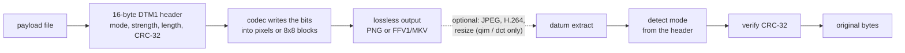

# datum

**Hide any file inside the pixels of an image or a video — and get it back byte for byte.**

[](https://github.com/iEmreM/datum/actions/workflows/ci.yml)
[](LICENSE)


`datum` is a command-line tool that writes any file (a document, an archive, another
image) directly into the pixel values of a photo or a video. It does not append the
file to the end.

- **Images and video:** hide a file in a photo, or spread it across a video's frames.
- **Exact recovery:** `extract` detects the mode on its own and verifies the file with a
  CRC-32.
- **Five modes:** from invisible to the eye (`lsb`) to surviving JPEG, H.264/VP9 and
  resizing (`dct`).
- **Built-in steganalysis:** `datum analyze` shows how detectable a hidden file is.

```sh
datum embed   -i photo.png -o stego.png -d secret.zip --mode lsb   # image → PNG
datum embed   -i clip.mp4  -o stego.mkv -d secret.zip --mode lsb   # video → MKV
datum extract -i stego.png -o secret.zip                           # mode detected automatically
```

---

## Contents

- [Features](#features)
- [How it works](#how-it-works)
- [Choosing a mode](#choosing-a-mode)
- [Getting started](#getting-started)
- [Quick start: hide a file in three steps](#quick-start-hide-a-file-in-three-steps)
- [Guides](#guides)
  - [Hide a file invisibly](#1-hide-a-file-invisibly-lsb)
  - [Survive a JPEG re-save](#2-survive-a-jpeg-re-save-qim)
  - [Survive an upload: re-encode and resize](#3-survive-an-upload-re-encode-and-resize-dct)
  - [Hide a file in a video](#4-hide-a-file-in-a-video)
  - [Check your own work](#5-check-your-own-work-analyze)
- [Command reference](#command-reference)
- [What survives what](#what-survives-what)
- [Limitations and security](#limitations-and-security)
- [Troubleshooting](#troubleshooting)
- [Project layout](#project-layout)
- [Roadmap](#roadmap)
- [Contributing](#contributing)
- [License](#license)

---

## Features

- **Ordinary output files.** Nothing is appended to the file, and the result is a
  normal PNG or MKV that opens in any viewer or player.
- **Same commands for images and video.** A video payload can span many frames, or be
  copied into several frames so it survives a dropped frame (`--repeat`).
- **Self-describing.** A small header stores the mode, its strength setting, the
  payload length and a CRC-32. `extract` needs nothing but the file.
- **Fails loudly.** An oversized payload, a lossy output format, a mistyped flag or a
  corrupted carrier each give a clear error instead of a quietly wrong result.
- **Measured, not claimed.** `datum analyze` runs standard steganalysis against a
  carrier, and `datum_robustness` runs real encoders (JPEG, H.264, VP9, resizing)
  against every strength setting.
- **Small dependency surface.** C++20, the vendored `stb_image` headers, and the
  `ffmpeg` binary for video. No OpenCV, Boost or linked media libraries.

## How it works



1. `datum` puts a 16-byte **DTM1 header** in front of your file. The header records
   which mode wrote the data, the mode's strength setting, the payload length and a
   CRC-32 checksum. In `dct` mode the header and payload also get **Reed–Solomon**
   error correction.
2. The chosen **codec** writes that bit stream into the carrier. Depending on the
   mode, that means the low bits of each colour channel, a pixel's brightness, or the
   relation between two frequency coefficients of an 8×8 block.
3. The result is always saved **losslessly**, as PNG for images and FFV1 in MKV for
   video. A lossy format would round the pixel values and erase the payload on save,
   so `datum` refuses to write one.
4. `extract` tries each mode until it finds a header that agrees with the mode that
   read it, recovers the payload and checks the CRC.

`qim` and `dct` are built to survive lossy processing that happens *later*: someone
re-saves your PNG as JPEG, or a platform re-encodes and resizes your video.

## Choosing a mode

| Mode | What carries a bit | Capacity at 1920×1080 | Visible? | Survives lossy processing? |
|---|---|---|---|---|
| `lsb` | low 1–4 bits of each colour channel | 759 KiB per bit depth | No, at `--bits 1`–`2` | No, lossless only |
| `raw` | top 1–8 bits of each colour channel | 6.2 MB at `--bits 8` | Yes, the image turns to noise | `--bits 2` survives high-quality JPEG |
| `binary` | a pixel painted black or white | 253 KiB | Yes, fully | High-quality JPEG (spot-checked) |
| `qim` | a pixel's brightness snapped to a step | 253 KiB | Yes, flat areas band | High-quality JPEG, same size only |
| `dct` | which of two DCT coefficients is larger | 3.4 KiB per frame | Faint texture, close up | **JPEG, H.264, VP9, resizing** |

Pick by what will happen to the file after you embed:

- **The file will be passed around untouched** (a PNG in an archive, a lossless video)
  and nobody should notice anything → **`lsb`**.
- **You need maximum capacity** and do not care how the image looks → **`raw`**.
- **The image may be re-saved as a high-quality JPEG** at the same size → **`qim`**.
- **The image or video will be uploaded somewhere** that re-encodes and may resize it
  → **`dct`**. Use `--repeat` for video.
- **You want the sturdiest visible pattern** for a quick experiment → **`binary`**.

The full measurements are in [What survives what](#what-survives-what).

## Getting started

You can download a prebuilt binary (Option A) or build `datum` from source (Option B).

### Option A: Download a release

**Step 1: download.** Open the [Releases page](https://github.com/iEmreM/datum/releases)
and download the archive for your platform:

| Platform | File |
|---|---|
| Windows x86-64 | `datum-<version>-windows-x86_64.zip` |
| Linux x86-64 | `datum-<version>-linux-x86_64.tar.gz` |

Both binaries are statically linked and need no extra libraries. On other platforms,
use Option B.

**Step 2: extract it and check that it runs.**

```sh
tar -xzf datum-0.1.0-linux-x86_64.tar.gz
./datum-0.1.0-linux-x86_64/datum --version
# datum 0.1.0
```

On Windows, unzip the archive, open a terminal in the extracted folder and run
`.\datum.exe --version`. The executable is not code-signed, so SmartScreen may warn the
first time you run it.

**Step 3 (video only): install ffmpeg.** It is not bundled. Images work without it.

```sh
sudo apt install ffmpeg          # Debian/Ubuntu
winget install Gyan.FFmpeg       # Windows
```

To verify a download, compare it against the `SHA256SUMS.txt` file attached to the
release, for example with `sha256sum -c SHA256SUMS.txt --ignore-missing`.

### Option B: Build from source

#### Step 1: Install the requirements

| Requirement | Needed for | Notes |
|---|---|---|
| C++20 compiler | building | CI builds with GCC on Linux and MinGW-w64 GCC on Windows |
| CMake ≥ 3.20 | building | Ninja is optional but recommended |
| `ffmpeg` and `ffprobe` | video only | Not needed for images. Without them the video tests skip themselves. |

**Linux (Debian/Ubuntu)**

```sh
sudo apt install build-essential cmake ninja-build ffmpeg
```

**Windows (MSYS2)**: install [MSYS2](https://www.msys2.org/), open the **UCRT64**
shell and run:

```sh
pacman -S mingw-w64-ucrt-x86_64-gcc mingw-w64-ucrt-x86_64-cmake \
          mingw-w64-ucrt-x86_64-ninja mingw-w64-ucrt-x86_64-ffmpeg
```

Other platforms with a C++20 compiler should work, but CI does not cover them.

#### Step 2: Build

```sh
git clone https://github.com/iEmreM/datum.git
cd datum
cmake -S . -B build -G Ninja -DCMAKE_BUILD_TYPE=Release
cmake --build build
```

Without Ninja, leave out `-G Ninja` to use CMake's default generator.

The build produces three programs in `build/`:

| Program | Purpose |
|---|---|
| `datum` | the command-line tool |
| `datum_tests` | the test suite, run through `ctest` |
| `datum_robustness` | the measurement harness behind the robustness tables |

On Windows the MinGW build is statically linked, so `build\datum.exe` runs on its own
without any DLLs next to it.

#### Step 3: Run the tests

```sh
ctest --test-dir build --output-on-failure
```

All tests should pass. If the video tests fail with `no video stream in …`, see
[Troubleshooting](#troubleshooting).

> The examples below call `datum`. Either add its folder (the extracted release, or
> `build/`) to your `PATH`, or type the full path to the program.

## Quick start: hide a file in three steps

**Step 1: check that the file fits.**

```sh
datum capacity -i photo.png --mode lsb
# lsb: 777584 payload bytes (759 KiB), 16 byte header
```

**Step 2: embed it.** The output must be a `.png`.

```sh
datum embed -i photo.png -o stego.png -d secret.zip --mode lsb
# embedded 184320 bytes in lsb mode, PSNR 57.40 dB
```

`stego.png` looks exactly like `photo.png`. PSNR measures how much the picture
changed: above about 45 dB the change is invisible, and higher means quieter.

**Step 3: get it back.** No `--mode` is needed, because `datum` reads it from the
header.

```sh
datum extract -i stego.png -o recovered.zip
# extracted 184320 bytes from lsb mode, CRC ok
```

`CRC ok` means every byte is identical to the original.

> Without `--mode`, `embed` uses `raw`, which turns the picture into visible noise.
> Pass `--mode lsb` when the picture should still look like a picture.

The numbers above come from a generated 1920×1080 cover. Your own covers will give
different PSNR values.

## Guides

### 1. Hide a file invisibly (`lsb`)

`lsb` hides data in the lowest bits of each colour channel. It does not overwrite
those bits. Instead it moves each value to the *nearest* value that carries the right
bits (LSB matching). That changes a channel by at most ±1 at `--bits 1`, and it avoids
the statistical fingerprint that plain bit replacement leaves.

`--bits` trades invisibility for capacity. Measured on a generated 1080p cover with
the same 180 KiB payload:

| `--bits` | Capacity at 1080p | PSNR |
|---|---|---|
| 1 (default) | 759 KiB | 57.40 dB |
| 2 | 1.48 MiB | 53.07 dB |
| 3 | 2.22 MiB | 47.63 dB |
| 4 | 2.97 MiB | 42.05 dB |

At `--bits 4`, close inspection of flat areas may reveal it.

**Keep in mind:**

- `lsb` needs the file to stay lossless. Re-saving it as JPEG, or any re-encode,
  destroys the payload.
- **Do not fill the carrier.** The less of the capacity you use, the harder the
  payload is to detect. See [Check your own work](#5-check-your-own-work-analyze).

### 2. Survive a JPEG re-save (`qim`)

`qim` (Quantization Index Modulation) snaps each pixel's brightness to a multiple of a
step Δ, and the bit is carried by which multiple it lands on. Any later change smaller
than Δ/2 still decodes correctly. All three colour channels move together, so the
colours survive the chroma subsampling that JPEG and H.264 apply.

```sh
datum embed -i cover.png -o stego.png -d notes.txt --mode qim
# embedded 1900 bytes in qim mode, PSNR 38.83 dB

ffmpeg -i stego.png -q:v 2 stego.jpg          # someone re-saves it as a JPEG

datum extract -i stego.jpg -o notes.txt
# extracted 1900 bytes from qim mode, CRC ok
```

`--delta` (2–32, default 28) is the strength setting. A larger step survives harsher
compression and makes flat areas band more.

| Processing | Survives at the default Δ = 28 |
|---|---|
| Any lossless save | Yes |
| JPEG at quality 95 or better | **Yes** |
| JPEG at quality 85 or below | No |
| H.264 at CRF 15 or better | **Yes** |
| H.264 at CRF 18 or above | No |
| Any resize, crop or rotation | No, at any Δ |

Resizing replaces each pixel with an average of its neighbours, which no step size can
defend against. When the carrier may be resized, use `dct`.

Full sweep and how the default was chosen: [`docs/QIM.md`](docs/QIM.md).

### 3. Survive an upload: re-encode and resize (`dct`)

`dct` does not store the bit in any pixel's value. It splits the brightness into 8×8
blocks, like JPEG does, and stores one bit per block: *which of two mid-frequency DCT
coefficients is the larger*. A resize perturbs these coefficients but does not erase
them, and Reed–Solomon error correction (RS(255,223), up to 16 wrong bytes per
255-byte block) fixes the blocks that still come back wrong.

```sh
datum capacity -i cover.png --mode dct
# dct: 3490 payload bytes (3 KiB), 48 byte header, Reed-Solomon parity on top

datum embed -i cover.png -o stego.png -d key.txt --mode dct
# embedded 1200 bytes in dct mode, PSNR 31.03 dB

# shrink by 25%, scale back up, and save as JPEG
ffmpeg -i stego.png -vf scale=iw*3/4:ih*3/4,scale=iw*4/3:ih*4/3 -q:v 5 shrunk.jpg

datum extract -i shrunk.jpg -o key.txt
# extracted 1200 bytes from dct mode, CRC ok
```

`--margin` (2–64, default 32) is the strength setting: how far apart the two
coefficients are pushed. A larger margin survives harsher encodes and adds more
texture.

The price is capacity: 3490 bytes per 1080p image or frame. That is enough for keys,
links, identifiers or short text, not for archives.

Full sweep, the error-correction layout and how the default was chosen:
[`docs/DCT.md`](docs/DCT.md).

### 4. Hide a file in a video

Videos use the same commands. `datum` treats `.mp4 .mkv .mov .avi .webm .m4v .mpg
.mpeg .wmv .flv` as video, and **the output must be `.mkv`**.

**Step 1: inspect the video and check capacity.**

```sh
datum info -i clip.mp4
# 1280x720, 150 frames @ 30/1 fps
# 2764800 bytes per frame (rgb24)

datum capacity -i clip.mp4 --mode lsb
# lsb: 51839984 payload bytes (50624 KiB), 16 byte header
```

**Step 2: embed.** The payload fills the first frame, then the next, until it is all
written. Frames after that are left bit-identical.

```sh
datum embed -i clip.mp4 -o stego.mkv -d archive.zip --mode lsb
# embedded 4000000 bytes in lsb mode, filling 12 of 150 frames, PSNR 62.27 dB
```

**Step 3: extract.** Only the frames that carry data are decoded.

```sh
datum extract -i stego.mkv -o archive.zip
# extracted 4000000 bytes from lsb mode, CRC ok
```

What is preserved: resolution, frame rate, frame count and the audio tracks. Only the
first video stream and the audio streams are carried over, so subtitle and data
streams are dropped. Frames are streamed through ffmpeg one at a time, so memory use
does not grow with the length of the video.

The output is **much larger** than the input because FFV1 is lossless. In the example
above, a 3 MB MP4 became a 25 MB MKV.

**Surviving a video upload: `dct --repeat`.** A payload spread across frames is lost
when a single frame goes missing, and a frame-rate conversion drops frames.
`--repeat N` instead writes the *whole* payload into each of the first N frames and
takes a majority vote when extracting, so a lost or damaged frame only costs one vote:

```sh
datum capacity -i clip.mp4 --mode dct --repeat 9
# dct: 1528 payload bytes (1 KiB), 48 byte header, Reed-Solomon parity on top

datum embed -i clip.mp4 -o stego.mkv -d key.txt --mode dct --repeat 9
# embedded 1200 bytes in dct mode, copied into 9 of 150 frames, PSNR 39.73 dB

ffmpeg -i stego.mkv -vf fps=24 -c:v libx264 -crf 23 delivered.mp4   # 30 → 24 fps, H.264

datum extract -i delivered.mp4 -o key.txt
# extracted 1200 bytes from dct mode, CRC ok
```

With `--repeat`, the payload must fit in a single frame (1528 bytes for 720p above).
`extract` reads the repeat count from the header, so you never pass it again.

### 5. Check your own work (`analyze`)

"Invisible" and "undetectable" are different claims. `datum analyze` runs the two
classic attacks on hidden LSB data against any image, or against a video's first
frame:

```sh
datum analyze -i stego.png
# chi-square:  p(replacement) = 0.000 over 128 value pairs, worst in the first 100%
# RS analysis: 4.4% of the low bits look like payload (R 0.644 / S 0.100)
# verdict:     clean — neither test sees a payload
```

- **Chi-square** detects naive LSB *replacement*, which evens out the counts of value
  pairs (2i, 2i+1) in a way real photographs never do. It scans growing slices from
  the top, so it can also tell roughly where a payload ends.
- **RS analysis** estimates what share of the low bits carries a payload. It needs a
  real photograph: on pure noise the number means nothing.

Measured on a 3840×2160 photograph:

| Carrier | Chi-square `p` | RS estimate | Verdict |
|---|---|---|---|
| Clean cover | 0.000 | 1.2 % | clean |
| `lsb --bits 1`, 10% full | 0.000 | 4.4 % | **clean** |
| `lsb --bits 1`, 50% full | 0.000 | 15.6 % | RS sees it |
| `lsb --bits 1`, 100% full | 0.000 | 31.8 % | RS sees it |
| Naive LSB replacement, 10% full | 0.963 | 9.2 % | chi-square sees it |
| Naive LSB replacement, 50% full | 1.000 | 38.7 % | both see it |

Two lessons: `datum`'s LSB matching does not trigger chi-square at all, and **a lightly
filled carrier is much harder to detect than a full one.** Passing these two tests
does not mean a modern detector would miss the payload. Both attacks look for LSB
patterns, so a `qim` or `dct` carrier reads as "clean" here. That says nothing about
those modes, which are built for robustness, not concealment.

## Command reference

```
datum info     -i <carrier>
datum capacity -i <carrier> [--mode M] [--bits N | --delta N | --margin N] [--repeat N]
datum embed    -i <cover> -o <stego> -d <payload> [--mode M] [--bits N | --delta N | --margin N] [--repeat N]
datum extract  -i <stego> -o <payload> [--mode M]
datum analyze  -i <carrier>
datum help
datum --version
```

| Command | What it does |
|---|---|
| `info` | Image: size, channels and how many are usable. Video: size, frame count, frame rate. |
| `capacity` | The largest payload the carrier holds in the given mode. |
| `embed` | Hides `-d <payload>` in `-i <cover>` and writes `-o <stego>`, reporting PSNR. |
| `extract` | Recovers the payload and verifies its CRC. The mode is detected unless `--mode` is given. |
| `analyze` | Runs chi-square and RS steganalysis (on the first frame of a video). |
| `help`, `--version` | Prints the usage summary, or the version number. |

| Flag | Mode | Range | Default | Meaning |
|---|---|---|---|---|
| `--mode` | — | `binary` `raw` `lsb` `qim` `dct` | `raw` | embedding mode |
| `--bits` | `lsb` | 1–4 | 1 | payload bits in the *low* bits of each colour channel |
| `--bits` | `raw` | 1–8 | 8 | payload bits in the *top* bits; lower values leave a ±2^(7−N) drift margin |
| `--delta` | `qim` | 2–32 | 28 | quantiser step |
| `--margin` | `dct` | 2–64 | 32 | minimum separation of the two DCT coefficients |
| `--repeat` | any mode, video only | 1–32 | 1 | whole-payload copies, one per frame, majority-voted |

**Rules the tool enforces:**

- Every flag takes a value. Unknown flags are rejected, and so are strength flags that
  belong to another mode (`--bits` with `--mode qim`, for example), so a typo can never
  be silently ignored.
- Image output must be `.png`, and video output must be `.mkv`.
- Input images can be PNG, JPEG, BMP, TGA or GIF. They are decoded first and always
  saved as PNG.
- Transparency is kept: the alpha channel is never written to. Greyscale images work,
  with a third of an RGB image's `lsb` / `raw` capacity.
- Exit codes: `0` on success, `2` when the command is missing or unknown, and `1` for
  every other error, including bad flags. The message goes to stderr.

**Environment variables:**

| Variable | Purpose |
|---|---|
| `DATUM_FFMPEG` | Path to the `ffmpeg` binary, if it is not on `PATH` as `ffmpeg` |
| `DATUM_FFPROBE` | Path to the `ffprobe` binary, if it is not on `PATH` as `ffprobe` |

## What survives what

| Mode | Lossless save | High-quality JPEG | JPEG q75 | H.264 CRF 23–28, VP9 CRF 40 | 30 → 24 fps | Downscale and back | Crop or new size |
|---|---|---|---|---|---|---|---|
| `lsb` | ✅ | ❌ | ❌ | ❌ | ❌ | ❌ | ❌ |
| `raw` (`--bits 8`) | ✅ | ❌ | ❌ | ❌ | ❌ | ❌ | ❌ |
| `raw --bits 2` | ✅ | ✅ ¹ | — | ❌ ¹ | — | — | ❌ |
| `binary` | ✅ | ✅ ² | — | ❌ ² | — | ❌ ² | ❌ |
| `qim` (Δ 28) | ✅ | ✅ | ❌ | ❌ | ❌ | ❌ | ❌ |
| `dct` (margin 32) | ✅ | ✅ | ✅ | ✅ | ✅ | ✅ | ❌ |

✅ the file came back byte for byte · ❌ it did not · — not measured

- The `qim` and `dct` rows come from `datum_robustness` on a 640×480 generated cover
  filled to 25%: [`docs/QIM.md`](docs/QIM.md), [`docs/DCT.md`](docs/DCT.md). Other
  covers and fuller carriers move the boundaries, and a fuller `dct` carrier needs a
  larger margin.
- ¹ [`docs/RAW_BITS.md`](docs/RAW_BITS.md): ffmpeg JPEG at `-q:v 2`; H.264 at CRF 18
  and 23.
- ² A spot check on one generated 1080p cover, outside the harness: ffmpeg JPEG at
  `-q:v 2` and `-q:v 10`, H.264 at CRF 23 and 28, and a 3/4 downscale.
- **None of this has been measured against a real YouTube upload.** The encoder
  settings were chosen to approximate one.

To reproduce the tables (needs ffmpeg):

```sh
build/datum_robustness --fill 0.25                        # qim, generated cover
build/datum_robustness --mode dct --fill 0.25             # dct, generated cover
build/datum_robustness --mode dct -i photo.png --fill 0.1 # your own RGB cover, sides a multiple of 8
```

## Limitations and security

- **`datum` is not encryption.** Anyone who has `datum` can extract a payload, because
  there is no key yet. Encrypt the file first (for example with `age`, `gpg` or an
  encrypted archive), then hide it.
- **The header is plaintext and data is written in raster order.** Someone who
  suspects a carrier can confirm it by running `datum extract` on it. Keyed scatter
  and header whitening (`--key`) are the next planned phase.
- **Passing `analyze` is not a proof of safety.** It covers the two classic attacks,
  not modern content-adaptive detectors.
- **`dct` cannot handle cropping or size changes.** The carrier must reach the decoder
  at its original size. A resize that ends at the original size is fine.
- **Payloads are limited to 4 GiB** (the header stores a 32-bit length), and the whole
  payload is read into memory.
- **File names with non-ASCII characters may fail on Windows** when they are passed on
  the command line, and for video input and output.
- **Hiding data does not hide the file itself.** An unusually large PNG, or a lossless
  MKV where an MP4 was expected, can draw attention on its own.

Uploading steganographic content to a third-party platform is subject to that
platform's terms of service. Use your own content.

## Troubleshooting

| Error | Cause and fix |
|---|---|
| `no video stream in … (or ffprobe is missing — set DATUM_FFPROBE to its path)` | `ffprobe` is missing, or an old `ffprobe` from another package comes first on `PATH`. Run `ffprobe -version` to check which one is found, then point `DATUM_FFPROBE` (and `DATUM_FFMPEG` if needed) at the right binary. |
| `CRC mismatch — the payload is corrupted` | The carrier changed after embedding. Only `qim` and `dct` survive lossy processing. With `dct`, try a larger `--margin`, a less-filled carrier, or `--repeat` for video. |
| `no datum payload found (or the wrong mode was given)` | There is no payload, a forced `--mode` is wrong, or the carrier was cropped, resized or re-encoded in a mode that does not survive it. |
| `refusing to write x.jpg: only .png preserves exact pixel values` | Use a `.png` output for images and `.mkv` for video. |
| `payload needs N bytes but lsb holds only M` | Use a larger cover, a higher `--bits`, a different mode or a video. |
| `--bits does not apply to --mode qim` | Each mode has its own strength flag. See [Command reference](#command-reference). |
| `a repeated payload must fit in a single frame` | With `--repeat`, the whole payload goes into one frame. Use a smaller payload or a higher-resolution video. |

Setting the variables:

```sh
export DATUM_FFPROBE=/path/to/ffprobe                  # bash / zsh
$env:DATUM_FFPROBE = "C:\path\to\ffprobe.exe"          # PowerShell
```

## Project layout

```
apps/datum.cpp          command-line interface
include/datum/          public headers: image, bitstream, container, codec, ecc, video, analyze, io
src/                    implementation; all five codecs live in codecs.cpp
tests/roundtrip.cpp     the test suite (one executable, run by CTest)
tools/robustness.cpp    datum_robustness, the re-encode measurement harness
third_party/stb/        vendored stb_image and stb_image_write
docs/                   roadmap, design decisions and measurements
```

## Roadmap

| Phase | Scope | Status |
|---|---|---|
| 0–3 | Build, image I/O, `binary` / `raw` / `lsb`, DTM1 container, video | ✅ |
| 4 | LSB matching, `datum analyze` | ✅ |
| 4b | Keyed embedding: `--key`, scatter, payload and header whitening | ☐ next |
| 5 | `qim` mode, robustness harness | ✅ |
| 6 | `dct` mode, Reed–Solomon, `--repeat` | ✅ |
| 7 | Performance: profiling, parallel frames | ☐ |

The design decisions behind each phase, the open questions and the backlog are in
[`docs/ROADMAP.md`](docs/ROADMAP.md). Released versions and their changes are listed in
[`CHANGELOG.md`](CHANGELOG.md); version 0.1.0 covers Phases 0–6.

## Contributing

Issues and pull requests are welcome. Discussion can be in English or Turkish; code,
comments and docs are in English.

1. Build and run the tests as in [Getting started](#getting-started). CI runs the same
   steps on Windows and Linux.
2. Format with `clang-format` (the repository's `.clang-format`). CI rejects
   unformatted code.
3. Add a check to `tests/roundtrip.cpp` for any behaviour change. Assert the failure
   case as well as the success case.
4. Robustness claims need numbers. Measure with `datum_robustness` and record the
   results in `docs/`.
5. Do not add dependencies lightly. [`docs/ROADMAP.md` §4](docs/ROADMAP.md#4-dependencies--deliberately-minimal)
   explains what is used and why.

## License

[MIT](LICENSE) © 2026 İsmail Emre
